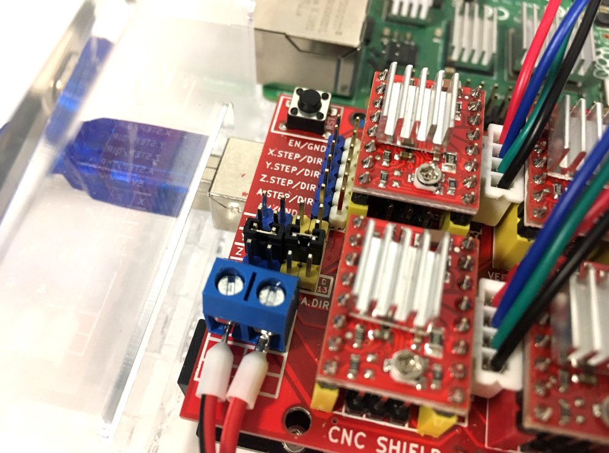
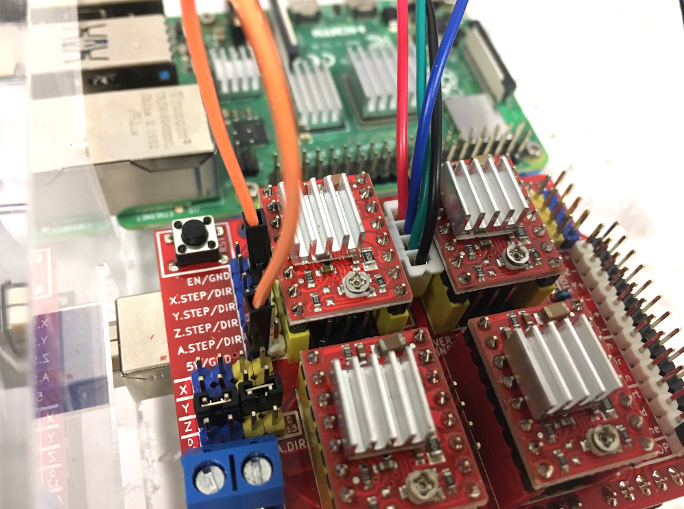
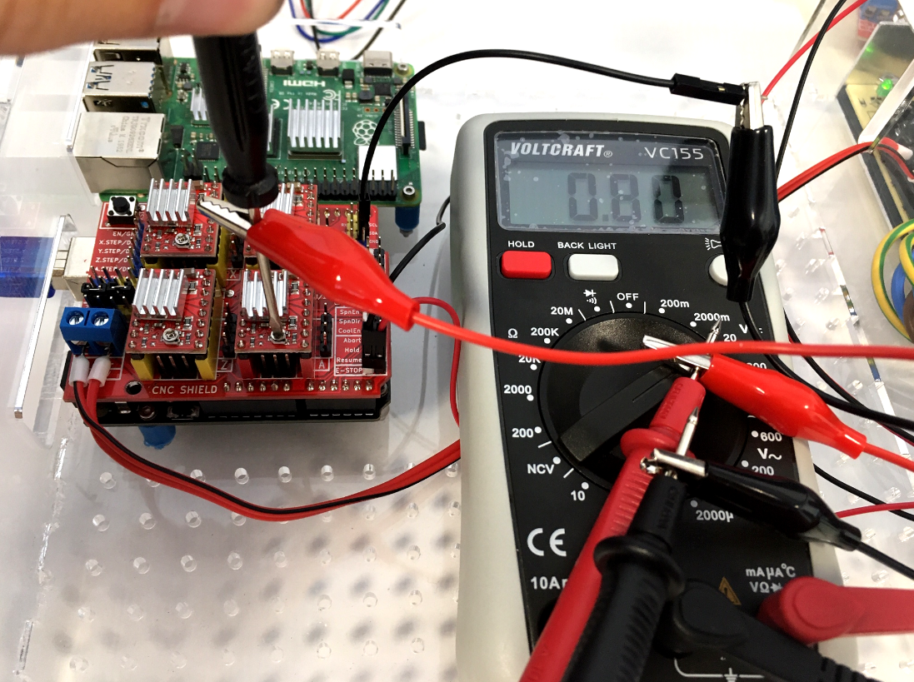

# Update Arduino board and CNC shield  

{{BOM}}

>i **Note**    
>i In the following section we will consider the CNC shiled is used to move 4 motors on axis X, Y and Z, with a clone on Z axis (therefore 2 motors for Z axis).
    
This is what the CNC shield should look like. 
  
  

Make sure : 

* It is powered (wires on the bottom left of the image, connected to the PSU);
* The emergency button is connected (wires on the bottom right of the image);
* The A4899 stepper drivers are plugged corretly (potentiometer directed toward the bottom of the CNC shield).
* The Arduino Uno is connected to a computer. Not necesserly the RPi, you can connect it to another computer if you feel more confortable to upload Grbl and test the CNC shield.

## Upload the firmware : Grbl {pagestep}
To upload Grbl on the [Arduino board], just follow instructions available on [Grbl's wiki ](https://github.com/gnea/grbl/wiki/Compiling-Grbl).  

>i **With less than 3 axis**  
>i According to the number of axis you want, you will have a few changes to make on the `config.h` file located in `Arduino>libraries>grbl`. Open it with a text editor, then read from line 90 to 113.  
>i Examples:
>i
>i * **Just X and Y axis ?** Comment lines 105 and 106, and uncomment line 110 as follow:  
>i *105 : // #define HOMING_CYCLE_1 ((1<<X_AXIS)|(1<<Y_AXIS))  // OPTIONAL: Then move X,Y at the same time.*  
>i *106 : // #define HOMING_CYCLE_2                         // OPTIONAL: Uncomment and add axes mask to enable*  
>i *110 : #define HOMING_CYCLE_0 ((1<<X_AXIS)|(1<<Y_AXIS))  // NOT COMPATIBLE WITH COREXY: Homes both X-Y in one cycle.*  
>i * **Just X and Z axis in this order ?** Modify lines 105 and 106 as follow:    
>i *105 : #define HOMING_CYCLE_0 (1<<X_AXIS)                // Move X first.*   
>i *106 : #define HOMING_CYCLE_1 (1<<Z_AXIS) // Then move Z.*    
>i Then compile and flash Grbl to the Arduino, from the Arduino IDE : `File>Examples>grbl>grblUpload`.  

Once Grbl is compiled and flashed to the Arduino board, it is a good idea to have default settings in a first place. Open the Serial Monitor in the Arduino IDE (Tools > Serial Monitor), then check Grbl settings typing `$$` then Enter, into the Serial Monitor. The settings should look like this (according to [Grbl wiki : Grbl v1.1 Configuration](https://github.com/gnea/grbl/wiki/Grbl-v1.1-Configuration)) :  
<pre>
Settings and sample values 	Description
$0=10 	Step pulse, microseconds
$1=25 	Step idle delay, milliseconds
$2=0 	Step port invert, mask
$3=0 	Direction port invert, mask
$4=0 	Step enable invert, boolean
$5=0 	Limit pins invert, boolean
$6=0 	Probe pin invert, boolean
$10=1 	Status report, mask
$11=0.010 	Junction deviation, mm
$12=0.002 	Arc tolerance, mm
$13=0 	Report inches, boolean
<b style="color:green">$20=0 	Soft limits, boolean</b>
<b style="color:green">$21=0 	Hard limits, boolean</b>
$22=1 	Homing cycle, boolean
<b style="color:green">$23=0 	Homing dir invert, mask</b>
$24=25.000 	Homing feed, mm/min
$25=500.000 	Homing seek, mm/min
$26=250 	Homing debounce, milliseconds
$27=1.000 	Homing pull-off, mm
$30=1000. 	Max spindle speed, RPM
$31=0. 	Min spindle speed, RPM
$32=0 	Laser mode, boolean
<b style="color:green">$100=250.000 	X steps/mm
$101=250.000 	Y steps/mm
$102=250.000 	Z steps/mm
$110=500.000 	X Max rate, mm/min
$111=500.000 	Y Max rate, mm/min
$112=500.000 	Z Max rate, mm/min
$120=10.000 	X Acceleration, mm/sec^2
$121=10.000 	Y Acceleration, mm/sec^2
$122=10.000 	Z Acceleration, mm/sec^2
$130=200.000 	X Max travel, mm
$131=200.000 	Y Max travel, mm
$132=200.000 	Z Max travel, mm</b>
</pre>
If not, then copy each line, and paste it into the Serial Monitor.  

## Try with the stepper motors {pagestep}
Plug the 4x [stepper motors](Parts.yaml#StepperMotors){qty:4}.  

  

Then check the motors buy running the following commands into the serial monitor:   

`G91; This command set all axis to relative. I find it better to test the CNC shield, so you can run many times the same command.`  

Then:  

`G0 X10 Y10 Z10; G0 means 'rapid move' and X10 means 'move 10 mm on X axis'.`

### Clone the Z axis
Just add 2x [jumpers](Parts.yaml#Jumpers){qty:2} on the Z axis line (left of the CNC shield, as seen on the picture below).

  

>i **Note**  
>i 
>i * You can use the 4rth motor as a clone of X or Y: just place the jumpers on the corresponding line (as seen on the previsou picture).   
>i * You can also use the 4rth motor independently. In this case, add 2 jumpers on the last line after the X, Y and Z lines.

### Inverse motor direction
    
   

As seen on the picture, there are 3 possibilities:

* Rotate the connector to 180°;
* Connect a 5V pin to the DIR pin of interest. On the picture above, an orange jumpers wire is connecting 5V to X.DIR.
* Change the $3 parameter mask.

## Current limitation for stepper drivers  
When refering to [A4988 datasheet from Polulu](https://www.pololu.com/file/0J450/A4988.pdf), current limit should be set for each driver and its motor.   
>i **Quote from https://www.pololu.com/product/1182**
>i Another way to set the current limit is to calculate the reference voltage that corresponds to your desired current limit and then adjust the current limit potentiometer until you measure that voltage on the VREF pin. The VREF pin voltage is accessible on a via that is circled on the bottom silkscreen of the circuit board. The current limit, IMAX, relates to the reference voltage as follows:
>i 
>i IMAX=VREF8⋅RCS
>i 
>i or, rearranged to solve for VREF:
>i 
>i VREF=8⋅IMAX⋅RCS
>i 
>i RCS is the current sense resistance; original versions of this board used 0.050 Ω current sense resistors, but we switched to using 0.068 Ω current sense resistors in January 2017, which makes more of the adjustment potentiometer’s range useful. 

For example, with :  

* Stepper motor nominal current : 2A;
* RCS : 0.05 Ohm

We have : VREF=8*2*0.05=0.8V  

You can set the current limit as follow:  

* Make sure the Arduino board is powered (plugged to turned-on computer with USB cable);  
* Turn your [multimeter](Parts.yaml#Multimeter){qty:1, Cat:tool} on, and set it to voltage measurement;  
* Connect it to a ground GND pin on the CNC shield. To do so, connect a [female to male jumper wire](Parts.yaml#JumpersWires_FemaleMale){qty:1} to the GND pin, then connect it to the black probe of the multimeter with a [crocodile clip](Parts.yaml#CrocodileClip){qty:1, Cat:testconnector};  
* Clip another [crocodile clip]{qty:1} to a tiny screwdriver with conductive tip, and to the red probe of the multimeter;  
* Turn the potentiometer on the A4988 chip until you read VREF.

This is what it should look like:  

## Add limit switches
### Attach the limit switches
Possibilities :  
* No limit switches;  
* 1 limit switch / axis;  
* 2 limit switches / axis (1 on each side).  

Different configurations:  
* Normally opened;  
* Normally closed.  
  
### Test the limit switches
Make sure that all axis turns in the good direction, so that the limit switches will be triggered. If not, then change parameter $23 with another mask.
>! **Important note**
>!
>! When testing the homing without the belts attached, you have to trigger the limit switches manually. And the limit switches should be triggered 2 times, within a short period of time.   
>! The sequence of event is the following :  
>! 1. Motor moves toward the limit switch and hit it;  
>! 2. Motor moves backward for a distance set with parameter $27;  
>! 3. Motor moves toward the limit switch and hit it a 2nd time;  
>! 4. Then it moves backward for distance $27 again.  
>! When triggering the limit switch manually, if it is not triggered twice at within the correct amount of time, grbl will stop the process with an "ALARM" warning.

   
>! **What to do if Z limit switch is not working**
>!
>! As you can read in the config.h file (Arduino/libraries/grbl/), for Arduino Unos when VARIABLE_SPINDLE is enable Z-limit pin D11 and spindle enable pin D12 switch ! Therefore you have to possibilities to fix that :  
>! - If you don't use the variable spindle, then comment the line 339 in config.h "#define VARIABLE_SPINDLE", and reupload grbl on the Arduino.  
>! - If you use it, then plug the Z-limit switch on the SpinEn pins on the CNC shield, and the spindle wires to the z-lim pins.

## Change the steps/mm
For regular pulley and belts : https://blog.prusa3d.com/calculator_3416/
For the Z-axis = uStep*nb_step/(2*Pi*r_gear) = 16*200/(3.14*15)
